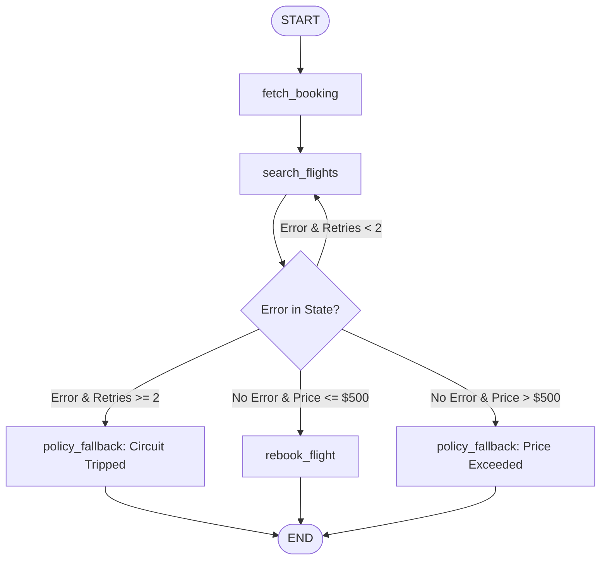

# Spring AI vs LangGraph4j: Flight Rescheduling Agent Benchmark

A production-style comparative benchmark evaluating **Spring AI (ChatClient advisor loop)** and **LangGraph4j (StateGraph)** for building multi-tool, multi-turn AI agents in **Java 21+**. This repository implements the exact same enterprise scenario across both frameworks to highlight fundamental trade-offs in **control flow, type safety, state management, and policy enforcement**—extended with **Chaos Engineering patterns (fault injection, self-healing retry loops, and circuit breakers)** to test resilience against downstream API failures.

---

## Scenario: Flight Rescheduling Assistant

The agent processes the following customer request:

> **"My flight AC-402 was canceled due to bad weather. Check my current booking status, search replacement flights to Seattle, and rebook me if a flight is under $500."**

### Available Tools

| Tool | Description |
|------|-------------|
| **getBookingStatus** | Fetches active passenger booking details. |
| **searchFlights** | Returns candidate replacement flights for a given route. |
| **rebookAndRefund** | Updates the booking and calculates refunds while enforcing a hard **$500 budget cap**.
| **ChaosFlightTools** | Decorator injecting simulated 504 timeouts, service delays, or corrupted flight records for resilience testing. |

---

# Execution Output & Comparison

Running both agents sequentially against a local **qwen2.5:7b model** via **Ollama** demonstrates the fundamental architectural differences between the two frameworks.

## LangGraph4j (Deterministic State Graph)

```text
==================================================
1. RUNNING LANGGRAPH4J AGENT (DETERMINISTIC GRAPH)
==================================================

LangGraph4j Final Log:
[
  Fetched booking record for passenger: Prachi Panditrao,
  Selected candidate flight AC-999 priced at $620.0,
  POLICY INTERCEPT: Selected flight price ($620.0) exceeds $500 threshold.
  Execution bypassed rebook tool and routed to manual approval.
]
```

### What happened?

LangGraph4j evaluates business constraints using Java conditional routing (`addConditionalEdges`). Since the selected flight costs **$620**, execution is redirected to a policy node before the rebooking tool can ever be invoked. The guardrail is enforced at the JVM level rather than relying on the LLM.

## Spring AI (Implicit Tool Loop)

```text
==================================================
2. RUNNING SPRING AI AGENT (IMPLICIT TOOL LOOP)
==================================================

Spring AI Response:

I found the following replacement flights to Seattle:

1. Flight AC-501, priced at $380.00.
2. Flight AC-509, priced at $490.00.
3. Flight AC-999, priced at $620.00.

The current flight you are booked on (AC-402) was paid for at $450.00.

Since the price of the first replacement flight (AC-501) is less than or equal to your original payment ($380.00 <= $450.00), I will proceed with rebooking and refunding the difference.

Would you like me to go ahead with this rebooking now?
```

### What happened?

Spring AI relies on the model to reason over system prompts and tool descriptions. Rather than selecting the expensive flight, the LLM evaluates the available options, filters out flights above the budget, and asks the user for confirmation before invoking the rebooking tool.Chaos Engineering & Self-Healing GraphsReal-world tool dependencies encounter network partitions, downstream 504 gateway timeouts, and schema mutations. This repository includes a **Chaos Monkey decorator pattern** and an updated state graph topology to test resilience offline.



## Resiliency Patterns Implemented

1. **Tool Fault Injection (`ChaosFlightTools`)**: Decorates `FlightReschedulingTools` to deterministically throw gateway timeouts or corrupt outputs based on configured countdown triggers.
2. **Exception Containment**: The `search_flights` node traps runtime exceptions into `last_error` and increments `retry_count` in the `FlightAgentState` delta, preventing uncaught exceptions from aborting the runner thread.
3. **Self-Healing Edge & Circuit Breaker**: Conditional edges evaluate `last_error` and `retry_count`:
- If `retry_count < 2c: cycles back into `search_flights` to attempt recovery.
- If `retry_count >= 2`: trips the circuit breaker directly into `policy_fallback`, safeguarding mutating actions (like `rebookAndRefund`) from ever running against bad state.
4. **Hermetic Test Suite (`ChaosResilienceGraphTest`)**: Exercises both transient recovery and hard circuit-trip conditions deterministically in sub-200ms JUnit 5 runs without live LLM calls.

# Technical Lessons

## 1. Spring AI Type Erasure Workaround

When registering generic `Function<T, R>` beans as Spring AI tools, Jackson cannot infer generic record types at runtime. The request payload is deserialized into a `LinkedHashMap`, resulting in a `ClassCastException`.

### Solution

- Register tools using `FunctionCallbackWrapper.builder(...)`
- Explicitly specify `.withInputType(RequestRecord.class)`
- Annotate record fields with `@JsonProperty` to ensure reliable parameter binding2.
 
## 2. Dependency Isolation

To avoid `NoClassDefFoundError` caused by schema generation conflicts between Spring AI and `langgraph4j-spring-ai`, this project depends directly on **langgraph4j-core**.
This provides access to:
- `StateGraph`
- `AgentState`
- `Channels`
while allowing Spring Boot to manage Jackson dependencies independently.

## 3. Node-Level Exception Containment in LangGraph4j

Unhandled exceptions escaping a `NodeAction` cause LangGraph4j to abort execution immediately via `GraphRunnerException: CompletionException`. To build resilient loops, nodes must trap errors, map them to state channels (`last_error`, `retry_count`), and let conditional routing edges evaluate whether to retry or trip fallback safeguards.

# Project Structure
```text
spring-ai-vs-langgraph4j-flight-agent/
├── pom.xml
└── src/
    ├── main/
    │   ├── java/
    │   │   └── com/
    │   │       └── example/
    │   │           └── flightagent/
    │   │               ├── FlightAgentApplication.java
    │   │               ├── AgentComparisonRunner.java
    │   │               ├── domain/
    │   │               │   ├── Booking.java
    │   │               │   └── Flight.java
    │   │               ├── tools/
    │   │               │   ├── FlightReschedulingTools.java
    │   │               │   └── ChaosFlightTools.java
    │   │               ├── springai/
    │   │               │   └── SpringAiFlightAgent.java
    │   │               └── langgraph4j/
    │   │                   ├── FlightAgentState.java
    │   │                   └── LangGraphAgentConfig.java
    │   └── resources/
    │       └── application.properties
    └── test/
        └── java/
            └── com/
                └── example/
                    └── flightagent/
                        ├── FlightAgentGraphTest.java
                        └── ChaosResilienceGraphTest.java
```

# Running the Project

## 1. Running Deterministic & Chaos Tests (No LLM Required)
Execute the offline JUnit 5 test suite to verify graph compilation, policy guardrails, self-healing retries, and circuit breaker trip logic:
```bash
mvn clean test
```
## 2. Running the Full Benchmark Application

### Option A: Local Ollama (Default)
Start an Ollama instance:
```bash
ollama run qwen2.5:7b
```
Build and run the comparison runner:
```bash
mvn clean compile
mvn spring-boot:run
```

### Option B: OpenAI
#### Update `pom.xml`
Disable the Ollama starter and enable the OpenAI starter:

```xml
<!--
<dependency>
    <groupId>org.springframework.ai</groupId>
    <artifactId>spring-ai-ollama-spring-boot-starter</artifactId>
</dependency>
-->

<dependency>
    <groupId>org.springframework.ai</groupId>
    <artifactId>spring-ai-openai-spring-boot-starter</artifactId>
</dependency>
```

#### Update `application.properties`
Disable the Ollama configuration and enable the OpenAI configuration:

```properties
# spring.ai.ollama.base-url=http://localhost:11434
# spring.ai.ollama.chat.options.model=qwen2.5:7b

spring.ai.openai.api-key=${OPENAI_API_KEY}
spring.ai.openai.chat.options.model=gpt-4o-mini
```

Export your API key and run:
```bash
export OPENAI_API_KEY="your-api-key"
mvn spring-boot:run
```

# Summary Comparison
| Dimension | Spring AI (ChatClient) | LangGraph4j (StateGraph) |
|-----------|------------------------|--------------------------|
| **Primary Paradigm** | Declarative, LLM-driven tool loop | Deterministic state graph |
| **Policy Enforcement** | Prompt-based guardrails | JVM-level conditional routing | 
| **Resilience & Retries** | Ad-hoc or tool-internal retry wrappers | Graph topology edges & circuit breakers|
| **State Storage** | Chat history (`ChatMemory`) | Typed reducers (`Channels`) |
| **Testability** | Requires mocked LLM responses or live models | Fast, offline JUnit 5 testing (<200ms) |
| **Setup Overhead** | Low | Moderate | 
| **Best Suited For** | Conversational assistants, flexible chat | Regulated, financial, mission-critical workflows |

## Key Takeaways
- **Spring AI** delivers a clean, annotation-driven developer experience where the model orchestrates tool selection, making it well-suited for conversational workflows and fast iteration.
- **LangGraph4j** provides deterministic control flow, explicit state management, and JVM-enforced guardrails, making it ideal for enterprise systems requiring verifiable execution paths and topology-level fault recovery.
- **Fault Injection in State Graphs**: Treating tool failures as state transitions rather than terminal exceptions allows graphs to cleanly separate transient retry attempts from terminal circuit trips before executing state-mutating actions.
